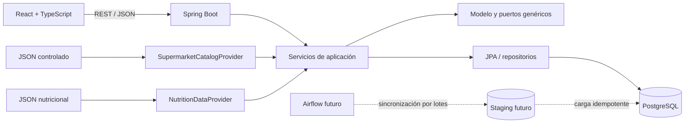

# Arquitectura

## Visión

Supermarket Meal Planner comienza como un monolito modular. Esta forma permite
transacciones sencillas, despliegue único y límites de código claros sin asumir
el coste operativo de microservicios.



## Módulos

- `supermarket`: catálogo de supermercados, estado y procedencia.
- `catalog`: categorías, productos, consulta e importación.
- `nutrition`: nutrición y proveedores de enriquecimiento.
- `shared`: paginación, Problem Details y lectura de datos controlados.
- `configuration`: OpenAPI y configuración transversal.
- `mealplan` y `shoppinglist`: límites previstos, todavía sin implementación.

Cada módulo separa `domain`, `application` e `infrastructure` cuando existe
comportamiento real. No se crean paquetes o clases vacíos para simular avance.

## Flujo actual

1. Flyway crea y valida el esquema, y registra los supermercados.
2. `CatalogSeedRunner` invoca el servicio de importación.
3. `LocalJsonSupermarketCatalogProvider` normaliza categorías y productos.
4. `LocalJsonNutritionDataProvider` aporta nutrición por código o nombre.
5. El importador actualiza de forma idempotente y nunca elimina productos.
6. Los servicios de consulta mapean entidades persistentes a DTOs.
7. El frontend obtiene supermercados, salud y productos con TanStack Query.

## Proveedores de supermercado

El puerto principal es:

```java
public interface SupermarketCatalogProvider {
    SupermarketCode supportedSupermarket();
    List<ExternalCategory> fetchCategories();
    List<ExternalProduct> fetchProducts();
    Optional<ExternalProduct> fetchProduct(String externalId);
}
```

El adaptador actual lee JSON local. Un adaptador específico futuro vivirá dentro
de infraestructura y podrá sustituirse sin alterar el dominio o la API. No se
presupone ninguna API oficial ni endpoint privado.

## Airflow futuro

`supermarket_catalog_sync` ejecutará extracción, normalización, validación,
carga, histórico, bajas lógicas e informe. `nutrition_enrichment` buscará datos,
calculará confianza y almacenará únicamente coincidencias válidas.

Los DAGs serán idempotentes, por lotes, con reintentos configurables. Los
catálogos no viajarán completos por XCom; se usarán staging o almacenamiento
compartido. No habrá scraping agresivo.

## Decisiones y límites

- Flyway es el único propietario del esquema; Hibernate solo valida.
- UUID facilita IDs públicos y la futura consolidación de varias fuentes.
- `BigDecimal`/`NUMERIC` se usan para dinero y cantidades.
- Las marcas externas solo aparecen como datos o adaptadores de infraestructura.
- Los costes futuros se calcularán por paquetes comprados.
- Los cálculos financieros y nutricionales serán deterministas.
- CQRS, microservicios, eventos distribuidos, Redis y Kubernetes quedan fuera
  de esta fase.

## Planificador previsto

El primer motor será `ScoringMealPlanGenerationStrategy`, determinista y basado
en reglas. Penalizará desviación calórica, déficit proteico, exceso de
presupuesto, repetición y desperdicio, respetando siempre restricciones y
alérgenos. `OrToolsMealPlanGenerationStrategy` será una opción posterior.

Un puerto futuro de lenguaje natural podrá interpretar preferencias, pero nunca
calculará precios ni nutrientes ni acoplará el dominio a un proveedor de IA.
