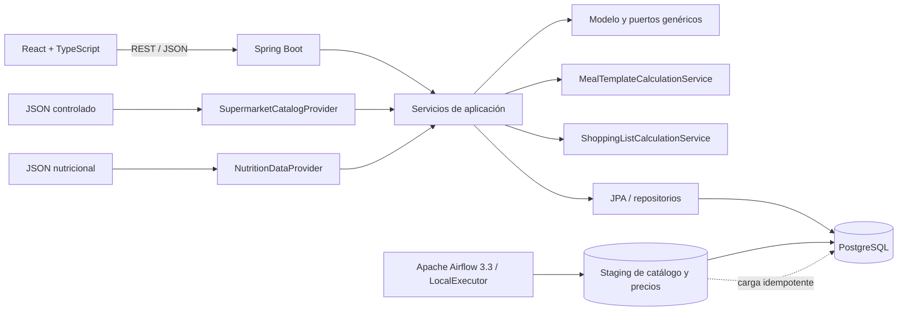
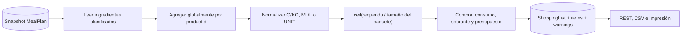
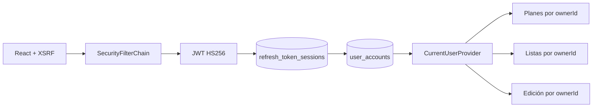
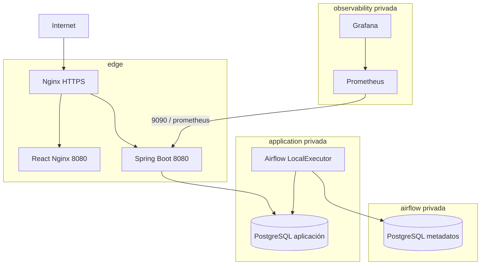
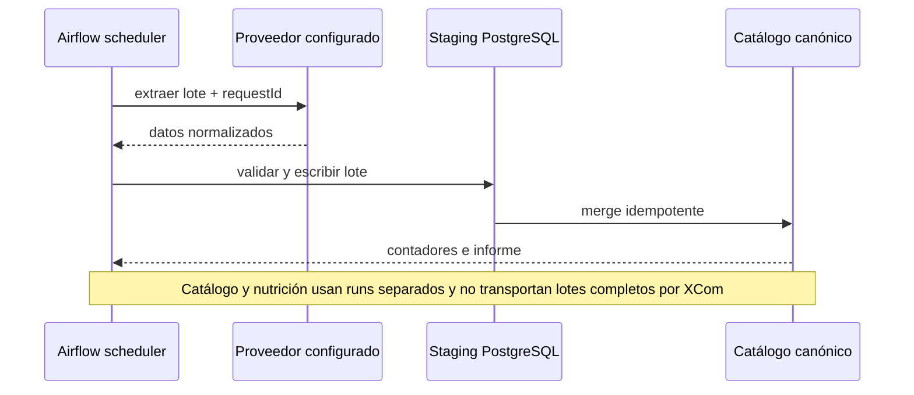
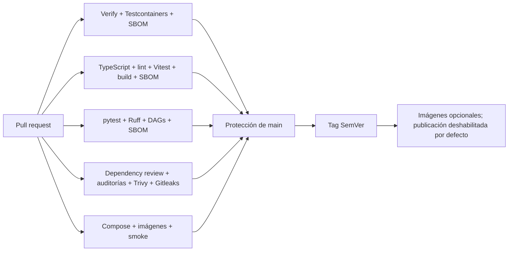

# Arquitectura

## Visión

Supermarket Meal Planner comienza como un monolito modular. Esta forma permite
transacciones sencillas, despliegue único y límites de código claros sin asumir
el coste operativo de microservicios.



## Módulos

- `supermarket`: catálogo de supermercados, estado y procedencia.
- `catalog`: categorías, productos, consulta e importación.
- `nutrition`: nutrición y proveedores de enriquecimiento.
- `mealtemplate`: plantillas reutilizables, validación, cálculos y persistencia.
- `mealplan`: generación determinista, preview, persistencia y snapshots.
- `shoppinglist`: agregación global, paquetes, costes, desperdicio, snapshots,
  persistencia, filtros y exportación.
- `shared`: paginación, Problem Details y lectura de datos controlados.
- `configuration`: OpenAPI y configuración transversal.

Cada módulo separa `domain`, `application` e `infrastructure` cuando existe
comportamiento real. No se crean paquetes o clases vacíos para simular avance.

## Flujo actual

1. Flyway crea y valida el esquema, y registra los supermercados.
2. `CatalogSeedRunner` invoca el servicio de importación.
3. `LocalJsonSupermarketCatalogProvider` normaliza categorías y productos.
4. `LocalJsonNutritionDataProvider` aporta nutrición por código o nombre.
5. El importador actualiza de forma idempotente y nunca elimina productos.
6. `ProductSpecifications` compone búsqueda y filtros sin multiplicar métodos
   de repositorio.
7. Los servicios de consulta enriquecen por lote y mapean entidades a DTOs.
8. El frontend obtiene metadatos, productos y detalle con TanStack Query; los
   filtros son estado navegable en la URL.
9. `MealTemplateSeedRunner` importa 16 plantillas tras finalizar el catálogo.
10. `MealTemplateService` valida supermercado, productos, duplicados y unidades;
    delega cálculos puros y deterministas en `MealTemplateCalculationService`.
11. La API devuelve totales, valores por ración, completitud y avisos. El
    frontend puede pedir el mismo cálculo con `/preview` sin persistir.
12. `MealPlanService` genera un preview determinista y persiste el árbol
    completo con snapshots de cada ingrediente.
13. `ShoppingListService` lee exclusivamente ese snapshot, agrega por producto
    en toda la semana y delega paquetes y costes en
    `ShoppingListCalculationService`.
14. La lista y sus artículos se persisten como un nuevo snapshot; regenerar
    archiva la versión activa anterior dentro de la misma transacción.

## Flujo de una plantilla

```mermaid
sequenceDiagram
    participant UI as React
    participant API as MealTemplateController
    participant App as MealTemplateService
    participant Calc as CalculationService
    participant DB as PostgreSQL
    UI->>API: POST /meal-templates/preview o CRUD
    API->>App: DTO validado
    App->>DB: supermercado y productos
    App->>App: valida unidades y duplicados
    App->>Calc: ingredientes + nutrición + precio
    Calc-->>App: totales, por ración y avisos
    App->>DB: persiste solo en CRUD
    App-->>UI: DTO; nunca entidad JPA
```

## Proveedores de supermercado

El puerto principal es:

```java
public interface SupermarketCatalogProvider {
    SupermarketCode supportedSupermarket();
    List<ExternalCategory> fetchCategories();
    List<ExternalProduct> fetchProducts();
    Optional<ExternalProduct> fetchProduct(String externalId);
}
```

El adaptador actual lee JSON local. Un adaptador específico futuro vivirá dentro
de infraestructura y podrá sustituirse sin alterar el dominio o la API. No se
presupone ninguna API oficial ni endpoint privado.

## Edición parcial

El módulo `mealplan` coordina búsqueda determinista, reevaluación exacta,
versiones y `meal_plan_changes`. Un preview firmado no escribe datos; su
confirmación verifica plan, objetivo y versión antes de actualizar en una sola
transacción el agregado persistido y su historial. Las listas comparan su
`sourcePlanContentVersion` al leer y no se archivan durante la edición.

## Airflow y sincronización de catálogo

La FASE 9 ejecuta `catalog_full_sync`, `catalog_price_sync` y `catalog_sync_cleanup` con metadatos PostgreSQL aislados. Los proveedores Python normalizan antes de staging y los merges son idempotentes. El backend solo crea el run y dispara la API REST v2; no procesa el catálogo en la petición HTTP.

## Enriquecimiento nutricional

La FASE 10 añade `nutrition_enrichment`. El backend administra runs y revisión; Airflow realiza el trabajo por lotes directamente contra PostgreSQL. `NutritionDataProvider` mantiene separados el proveedor local y Open Food Facts. Los candidatos persistidos evitan catálogos completos en XCom y el historial protege trazabilidad e idempotencia. Los snapshots de planes históricos permanecen inmutables.

`supermarket_catalog_sync` ejecutará extracción, normalización, validación,
carga, histórico, bajas lógicas e informe. `nutrition_enrichment` buscará datos,
calculará confianza y almacenará únicamente coincidencias válidas.

Los DAGs serán idempotentes, por lotes, con reintentos configurables. Los
catálogos no viajarán completos por XCom; se usarán staging o almacenamiento
compartido. No habrá scraping agresivo.

## Decisiones y límites

- Flyway es el único propietario del esquema; Hibernate solo valida.
- UUID facilita IDs públicos y la futura consolidación de varias fuentes.
- `BigDecimal`/`NUMERIC` se usan para dinero y cantidades.
- Las marcas externas solo aparecen como datos o adaptadores de infraestructura.
- Las plantillas calculan coste proporcional consumido. La lista de compra
  calcula por separado paquetes completos, coste de compra y sobrante.
- Los cálculos financieros y nutricionales serán deterministas.
- CQRS, microservicios, eventos distribuidos, Redis y Kubernetes quedan fuera
  de esta fase.

## Planificador previsto

El primer motor será `ScoringMealPlanGenerationStrategy`, determinista y basado
en reglas. Penalizará desviación calórica, déficit proteico, exceso de
presupuesto, repetición y desperdicio, respetando siempre restricciones y
alérgenos. `OrToolsMealPlanGenerationStrategy` será una opción posterior.

Un puerto futuro de lenguaje natural podrá interpretar preferencias, pero nunca
calculará precios ni nutrientes ni acoplará el dominio a un proveedor de IA.
## Flujo de generación semanal

```mermaid
flowchart LR
    UI[React: criterios] --> API[MealPlanController]
    API --> APP[MealPlanService]
    APP --> PORT[MealPlanGenerationStrategy]
    PORT --> SCORE[ScoringMealPlanGenerationStrategy]
    SCORE --> FILTER[Filtrado y cálculo obligatorio]
    FILTER --> BEAM[Beam search acotado]
    BEAM --> EXPLAIN[Score, advertencias y metadata]
    EXPLAIN -->|persist=false| UI
    EXPLAIN -->|persist=true + token válido| DB[(Snapshot PostgreSQL)]
```



El controlador solo valida el contrato y delega. El servicio selecciona la
estrategia por `GenerationStrategy`; el dominio no conoce beam search. Una
implementación futura basada en OR-Tools se conectará al mismo puerto.

La estrategia ordena las entradas, construye posiciones deterministas, filtra
antes de puntuar y limita la búsqueda a 24 estados y 8 candidatas por posición.
La seed solo desempata. Duración y `generatedAt` se añaden al final y no alteran
la selección.

Preview y persistencia son stateless: el frontend devuelve seed y fingerprint.
El servicio vuelve a generar, valida el token y guarda el árbol completo dentro
de una transacción. Véanse
[generación semanal](meal-plan-generation.md),
[ADR 0006](adr/0006-deterministic-scoring-generation.md) y
[ADR 0008](adr/0008-preview-persistence-token.md).

## Flujo de lista de compra



No se consulta el catálogo ni la plantilla viva para reconstruir una lista. Los
datos del producto y del paquete viajan en el snapshot del plan y vuelven a
quedar fijados en el snapshot de la lista. Si un plan antiguo no tiene esa
información, el artículo se conserva como no calculable y el resultado queda
marcado como parcial.

Las cantidades nunca se suman entre magnitudes: peso, volumen y unidades tienen
resúmenes independientes. Las incompatibilidades repetidas para un mismo
producto producen `422` con contexto seguro. Véanse
[listas de compra](shopping-lists.md),
[ADR 0009](adr/0009-shopping-list-snapshots.md) y
[ADR 0010](adr/0010-whole-package-rounding.md).

## Flujo de optimización sensible a compra

`MealPlanService` selecciona estrategias mediante `GenerationStrategy`.
`SCORING` conserva el beam clásico y `PURCHASE_AWARE_SCORING` añade a cada
estado un agregado inmutable de compra. Ambas rutas comparten filtrado,
candidatos, slots, seed y snapshots.

El calculador puro de `shared.application.purchase` no conoce JPA. El generador
lo usa en modo tolerante para representar candidatos parciales y
`ShoppingListCalculationService` en modo estricto para preservar sus contratos
de error. Así, las mismas entradas completas producen las mismas métricas.

La nueva ruta actualiza solo los productos de la comida añadida, conserva
deltas marginales y recalcula exactamente los finalistas. Véanse
[optimización de compra](purchase-aware-meal-plan-optimization.md) y
[ADR 0015](adr/0015-incremental-beam-without-or-tools.md).

## Identidad y límite de confianza

Spring Security valida CSRF/CORS y ejecuta un filtro JWT antes de los
controladores privados. El filtro resuelve `sid`, cuenta activa y revocación en
PostgreSQL; no confía únicamente en la firma. `CurrentUserProvider` es la única
entrada de identidad para servicios.



## Proyecciones de experiencia

El dashboard y los listados consultan columnas resumen sincronizadas con
`result_json` en la misma transacción. El feed une `user_activity_events` y
`meal_plan_changes`; esta última conserva la responsabilidad exclusiva sobre
las ediciones de FASE 6.

Consulta [dashboard-and-organization.md](dashboard-and-organization.md).

## Despliegue productivo



## Pipelines de datos



## CI/CD


