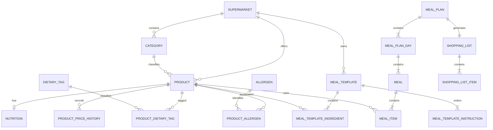

# Modelo de dominio

## Identificadores y tipos

Se usarán UUID en todas las entidades. Evitan revelar secuencias internas,
permiten fusionar datos procedentes de diferentes proveedores y son apropiados
como identificadores públicos.

- Dinero: `BigDecimal` y `NUMERIC(12,2)`.
- Cantidades: `BigDecimal` y `NUMERIC(12,3)`.
- Nutrición: valores por 100 g o por unidad explícita con `NUMERIC`.
- Tiempos: `OffsetDateTime`/`TIMESTAMPTZ`, normalizados a UTC.
- Unidades: códigos explícitos (`G`, `KG`, `ML`, `L`, `UNIT`).

Nunca se utilizarán `FLOAT` o `DOUBLE` para dinero.

## Entidades actuales

### Supermarket

`id`, `code`, `name`, `enabled`, `catalogSource`, `countryCode`,
`currencyCode`, `createdAt`, `updatedAt`.

`code` es estable y único. `enabled=false` identifica proveedores próximos.

### Category

`id`, `supermarketId`, `externalId`, `name`, `parentCategoryId`, `active`.

La clave `(supermarket_id, external_id)` es única.

### Product

`id`, `supermarketId`, `categoryId`, `externalId`, `barcode`, `name`, `brand`,
`description`, `imageUrl`, `productUrl`, `currentPrice`, `unitPrice`,
`packageQuantity`, `packageUnit`, `available`, `source`, `lastSyncedAt`,
`measurementType`, `costDataComplete`, `createdAt`, `updatedAt`.

Un producto ausente en una sincronización se conserva con `available=false`.
La clave `(supermarket_id, external_id)` evita duplicados.

### Nutrition

`id`, `productId`, calorías, proteína, carbohidratos, grasa, fibra, azúcar y sal
por 100 g, `dataSource`, `verificationStatus`, `confidenceScore`, `updatedAt`.
Para productos `UNIT` puede contener además los mismos nutrientes por unidad.

La relación con producto es uno a uno. Coincidir solo por nombre no convierte un
dato en verificado.

## Entidades de catálogo de la FASE 1

### ProductPriceHistory

`id`, `productId`, `price`, `unitPrice`, `recordedAt`. La clave por producto y
fecha de registro hace idempotente la importación JSON.

### DietaryTag y ProductDietaryTag

`DietaryTag(id, code, name)` y relación
`ProductDietaryTag(productId, dietaryTagId)`.

Los códigos actuales son `HIGH_PROTEIN`, `VEGETARIAN`, `VEGAN`, `GLUTEN_FREE`,
`LACTOSE_FREE`, `LOW_CALORIE` y `HIGH_FIBER`.

### Allergen y ProductAllergen

`Allergen(id, code, name)` y relación
`ProductAllergen(productId, allergenId, presenceType)`.

`presenceType` admite `CONTAINS`, `MAY_CONTAIN`, `TRACES` y `UNKNOWN`. Los
alérgenos controlados son gluten, leche, huevo, pescado, soja y frutos de
cáscara.

## Entidades de plantillas de la FASE 2

### MealTemplate

`id`, `supermarketId`, `externalId`, `name`, `description`, `mealType`,
`preparationMinutes`, `servings`, `active`, `archived`, `imageUrl`, `demoData`,
`createdAt`, `updatedAt`.

`mealType` admite `BREAKFAST`, `LUNCH`, `SNACK` y `DINNER`. La clave
`(supermarket_id, external_id)` hace idempotente la semilla. El archivado es
lógico y excluye el registro de consultas públicas.

### MealTemplateInstruction

`mealTemplateId`, `position`, `instruction`. Es una colección ordenada para
conservar pasos con cualquier signo de puntuación sin serialización frágil.

### MealTemplateIngredient

`id`, `mealTemplateId`, `productId`, `quantity`, `quantityUnit`, `optional`,
`sortOrder`, `notes`.

`quantityUnit` admite `GRAM`, `MILLILITER` y `UNIT`; debe coincidir con
`Product.measurementType`. La pareja `(meal_template_id, product_id)` es única.

Compatibilidad:

| MeasurementType | QuantityUnit | Base de cálculo |
| --- | --- | --- |
| `WEIGHT` | `GRAM` | nutrientes por 100 y paquete normalizado a gramos |
| `VOLUME` | `MILLILITER` | nutrientes por 100 y envase normalizado a mililitros |
| `UNIT` | `UNIT` | nutrientes explícitos por unidad y unidades por paquete |

No se realizan conversiones por densidad ni se inventan pesos por unidad.

Los nutrientes por peso o volumen se calculan como
`valorPor100 × cantidad / 100`. El coste consumido es
`precioPaquete × cantidadUsada / cantidadBasePaquete`. Los valores por ración
dividen cada total entre `servings`. Los cálculos usan `BigDecimal`,
`MathContext.DECIMAL128` y `RoundingMode.HALF_UP`; la API entrega una cifra
decimal para nutrientes y dos para dinero.

Si falta nutrición, precio, formato o una base compatible, se conserva el
ingrediente, se devuelve un aviso y el indicador de completitud correspondiente
queda a `false`.

## Entidades previstas posteriores

- `UserPreference`: gustos, exclusiones, alérgenos y restricciones; posterior a
  usuarios.

Relaciones principales:



## Costes y paquetes

El coste de compra se basará en paquetes enteros:

- paquete: 500 g;
- requerido: 1.200 g;
- paquetes: 3;
- comprado: 1.500 g;
- sobrante: 300 g.

El coste consumido puede mostrarse como métrica, pero el presupuesto se compara
contra el coste real estimado de los paquetes comprados.

## CatalogSyncRun futuro

Registrará `id`, supermercado, inicio, fin, estado, productos leídos, creados,
actualizados, no disponibles, cambios de precio y mensaje de error.
## Plan semanal

`MealPlan` pertenece a un supermercado y conserva nombre, fecha, duración,
comidas diarias, raciones, objetivos, presupuesto, estado, estrategia, seed,
token, totales, scores, métricas, completitud y timestamps.

`MealPlanDay` identifica de forma única `(mealPlanId, dayIndex)` y
`(mealPlanId, date)`. Guarda totales nutricionales, coste consumido,
desviaciones y score diario.

`PlannedMeal` identifica de forma única la posición dentro del día. Referencia
la plantilla original y conserva su nombre, tipo, raciones, ingredientes
obligatorios, nutrición, coste, score, completitud y advertencias del momento.

`MealPlanWarning` pertenece al plan y opcionalmente a un día. Contiene código,
mensaje, severidad y fecha.

Enums:

- `MealPlanStatus`: `DRAFT`, `GENERATED`, `ARCHIVED`.
- `GenerationStrategy`: `SCORING`.
- `WarningSeverity`: `INFO`, `WARNING`, `ERROR`.
- `VarietyPreference`: `LOW`, `MEDIUM`, `HIGH`.

### Invariantes

- 1–14 días, 1–6 comidas diarias y raciones mayores que cero.
- Objetivo calórico positivo, proteína no negativa y presupuesto positivo si
  existe.
- Todas las plantillas pertenecen al supermercado del plan.
- La posición es única dentro de cada día.
- Un plan persistido no puede volver a `DRAFT`.
- El archivado es lógico.

### Snapshot

Se usa persistencia híbrida: columnas relacionales para integridad y filtros,
tablas hijas para días/comidas/advertencias, y JSON de criterios y resultado
completo. El detalle se lee del snapshot, no se recalcula desde el catálogo.
La decisión se formaliza en
[ADR 0007](adr/0007-meal-plan-snapshots.md).

## Lista de compra

### ShoppingList

`id`, `mealPlanId`, snapshots de nombre del plan y supermercado, `status`,
`generatedAt`, `updatedAt`, conteos, costes consumido/compra/desperdicio,
porcentaje global de desperdicio, resúmenes de cantidad por magnitud,
presupuesto semanal y desviación, indicadores de completitud, duración y
`demoData`.

Solo puede existir una lista `GENERATED` por plan. Las versiones sustituidas
quedan `ARCHIVED`; el borrado es lógico.

### ShoppingListItem

Conserva snapshots de producto, marca, categoría, magnitud, formato, precio y
disponibilidad. Añade cantidad requerida, paquetes requeridos, cantidad
comprada, sobrante, coste consumido, coste de compra, coste desperdiciado,
porcentaje de sobrante, completitud, orden y avisos.

La cantidad se agrega por `productId` en toda la semana antes de calcular:

```text
paquetes = ceil(cantidad requerida normalizada / cantidad por paquete)
comprado = paquetes × cantidad por paquete
sobrante = comprado - requerido
coste de compra = paquetes × precio del paquete
coste desperdiciado = coste de compra - coste consumido
```

El presupuesto se compara con el coste de compra, no con el coste proporcional
consumido. Peso, volumen y unidades se resumen por separado; no existe un total
global que mezcle magnitudes.

### ShoppingListWarning

`id`, `shoppingListId`, `itemId` opcional, `code`, `message` y `severity`. Un
producto no disponible permanece visible. Si falta formato o precio, se
preserva el artículo con campos calculados nulos y la lista queda parcial.
La disponibilidad admite `null` únicamente para snapshots históricos donde el
dato era desconocido.

La lista se deriva exclusivamente del snapshot persistido del plan. No consulta
el producto o la plantilla actuales. Esto preserva la reproducibilidad y hace
explícita la compatibilidad con planes anteriores a la FASE 4.

## Métricas de optimización de compra

Los planes FASE 5 pueden contener `PurchaseMetrics`: coste consumido agregado,
coste real, coste y porcentaje de sobrante, envases, productos únicos,
productos reutilizados, reutilizaciones económicamente útiles y comparación
con presupuesto. También guardan razones deterministas y completitud.

`GenerationStrategy` admite `SCORING` y `PURCHASE_AWARE_SCORING`.
`OptimizationPreset` admite `BALANCED`, `LOWER_PURCHASE_COST`, `LOWER_WASTE` y
`MORE_REUSE`. Estrategia, preset, pesos y versión forman parte del snapshot y
del token. En planes históricos estas propiedades son opcionales.
