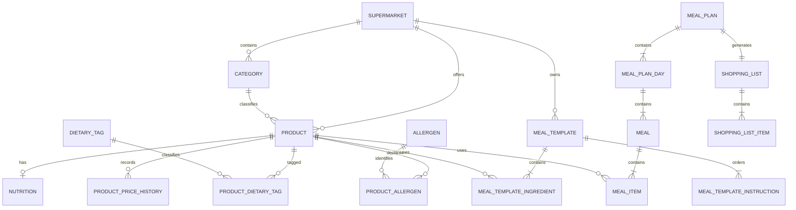

# Modelo de dominio

## Identificadores y tipos

Se usarán UUID en todas las entidades. Evitan revelar secuencias internas,
permiten fusionar datos procedentes de diferentes proveedores y son apropiados
como identificadores públicos.

- Dinero: `BigDecimal` y `NUMERIC(12,2)`.
- Cantidades: `BigDecimal` y `NUMERIC(12,3)`.
- Nutrición: valores por 100 g o por unidad explícita con `NUMERIC`.
- Tiempos: `OffsetDateTime`/`TIMESTAMPTZ`, normalizados a UTC.
- Unidades: códigos explícitos (`G`, `KG`, `ML`, `L`, `UNIT`).

Nunca se utilizarán `FLOAT` o `DOUBLE` para dinero.

## Entidades actuales

### Supermarket

`id`, `code`, `name`, `enabled`, `catalogSource`, `countryCode`,
`currencyCode`, `createdAt`, `updatedAt`.

`code` es estable y único. `enabled=false` identifica proveedores próximos.

### Category

`id`, `supermarketId`, `externalId`, `name`, `parentCategoryId`, `active`.

La clave `(supermarket_id, external_id)` es única.

### Product

`id`, `supermarketId`, `categoryId`, `externalId`, `barcode`, `name`, `brand`,
`description`, `imageUrl`, `productUrl`, `currentPrice`, `unitPrice`,
`packageQuantity`, `packageUnit`, `available`, `source`, `lastSyncedAt`,
`measurementType`, `costDataComplete`, `createdAt`, `updatedAt`.

Un producto ausente en una sincronización se conserva con `available=false`.
La clave `(supermarket_id, external_id)` evita duplicados.

### Nutrition

`id`, `productId`, calorías, proteína, carbohidratos, grasa, fibra, azúcar y sal
por 100 g, `dataSource`, `verificationStatus`, `confidenceScore`, `updatedAt`.
Para productos `UNIT` puede contener además los mismos nutrientes por unidad.

La relación con producto es uno a uno. Coincidir solo por nombre no convierte un
dato en verificado.

## Entidades de catálogo de la FASE 1

### ProductPriceHistory

`id`, `productId`, `price`, `unitPrice`, `recordedAt`. La clave por producto y
fecha de registro hace idempotente la importación JSON.

### DietaryTag y ProductDietaryTag

`DietaryTag(id, code, name)` y relación
`ProductDietaryTag(productId, dietaryTagId)`.

Los códigos actuales son `HIGH_PROTEIN`, `VEGETARIAN`, `VEGAN`, `GLUTEN_FREE`,
`LACTOSE_FREE`, `LOW_CALORIE` y `HIGH_FIBER`.

### Allergen y ProductAllergen

`Allergen(id, code, name)` y relación
`ProductAllergen(productId, allergenId, presenceType)`.

`presenceType` admite `CONTAINS`, `MAY_CONTAIN`, `TRACES` y `UNKNOWN`. Los
alérgenos controlados son gluten, leche, huevo, pescado, soja y frutos de
cáscara.

## Entidades de plantillas de la FASE 2

### MealTemplate

`id`, `supermarketId`, `externalId`, `name`, `description`, `mealType`,
`preparationMinutes`, `servings`, `active`, `archived`, `imageUrl`, `demoData`,
`createdAt`, `updatedAt`.

`mealType` admite `BREAKFAST`, `LUNCH`, `SNACK` y `DINNER`. La clave
`(supermarket_id, external_id)` hace idempotente la semilla. El archivado es
lógico y excluye el registro de consultas públicas.

### MealTemplateInstruction

`mealTemplateId`, `position`, `instruction`. Es una colección ordenada para
conservar pasos con cualquier signo de puntuación sin serialización frágil.

### MealTemplateIngredient

`id`, `mealTemplateId`, `productId`, `quantity`, `quantityUnit`, `optional`,
`sortOrder`, `notes`.

`quantityUnit` admite `GRAM`, `MILLILITER` y `UNIT`; debe coincidir con
`Product.measurementType`. La pareja `(meal_template_id, product_id)` es única.

Compatibilidad:

| MeasurementType | QuantityUnit | Base de cálculo |
| --- | --- | --- |
| `WEIGHT` | `GRAM` | nutrientes por 100 y paquete normalizado a gramos |
| `VOLUME` | `MILLILITER` | nutrientes por 100 y envase normalizado a mililitros |
| `UNIT` | `UNIT` | nutrientes explícitos por unidad y unidades por paquete |

No se realizan conversiones por densidad ni se inventan pesos por unidad.

Los nutrientes por peso o volumen se calculan como
`valorPor100 × cantidad / 100`. El coste consumido es
`precioPaquete × cantidadUsada / cantidadBasePaquete`. Los valores por ración
dividen cada total entre `servings`. Los cálculos usan `BigDecimal`,
`MathContext.DECIMAL128` y `RoundingMode.HALF_UP`; la API entrega una cifra
decimal para nutrientes y dos para dinero.

Si falta nutrición, precio, formato o una base compatible, se conserva el
ingrediente, se devuelve un aviso y el indicador de completitud correspondiente
queda a `false`.

## Entidades previstas del planificador

- `MealPlan`: supermercado, periodo, objetivos, presupuesto y estado.
- `MealPlanDay`: fecha, macros diarios y coste consumido estimado.
- `Meal`: tipo, instrucciones, macros y coste consumido.
- `MealItem`: producto, gramos/unidades, macros y coste.
- `ShoppingList`: plan, precio total estimado y creación.
- `ShoppingListItem`: cantidad requerida/comprada, paquetes, precio y sobrante.
- `UserPreference`: gustos, exclusiones, alérgenos y restricciones; posterior a
  usuarios.

Relaciones principales:

## Costes y paquetes

El coste de compra se basará en paquetes enteros:

- paquete: 500 g;
- requerido: 1.200 g;
- paquetes: 3;
- comprado: 1.500 g;
- sobrante: 300 g.

El coste consumido puede mostrarse como métrica, pero el presupuesto se compara
contra el coste real estimado de los paquetes comprados.

## CatalogSyncRun futuro

Registrará `id`, supermercado, inicio, fin, estado, productos leídos, creados,
actualizados, no disponibles, cambios de precio y mensaje de error.
