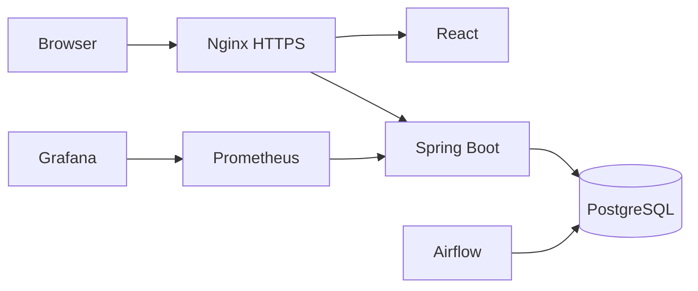
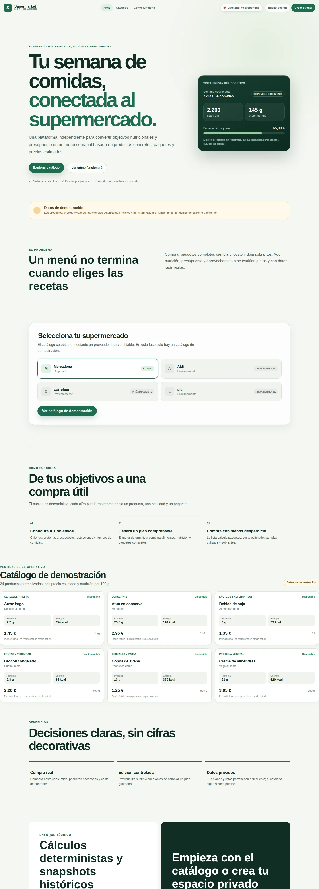
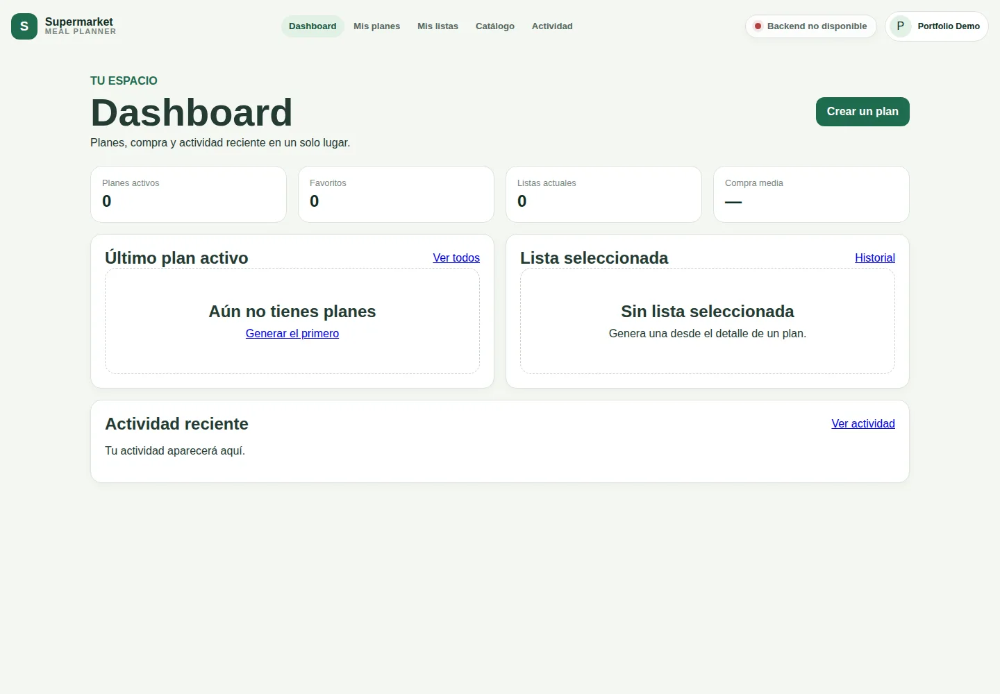
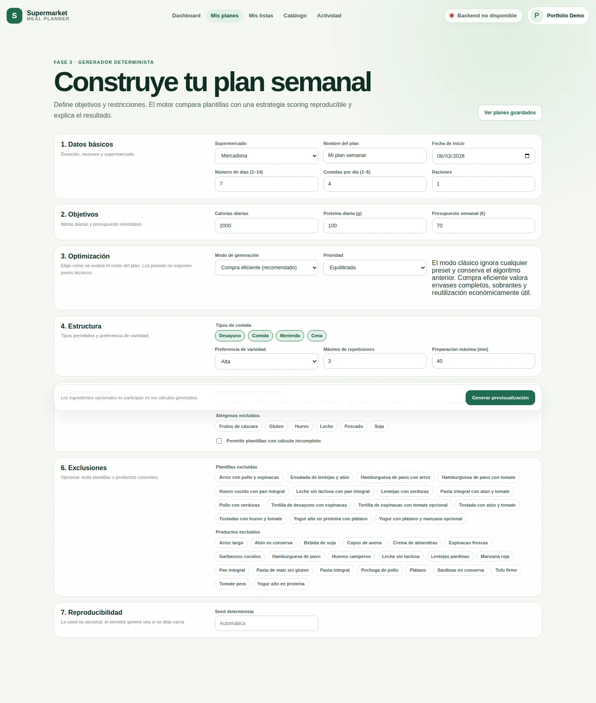
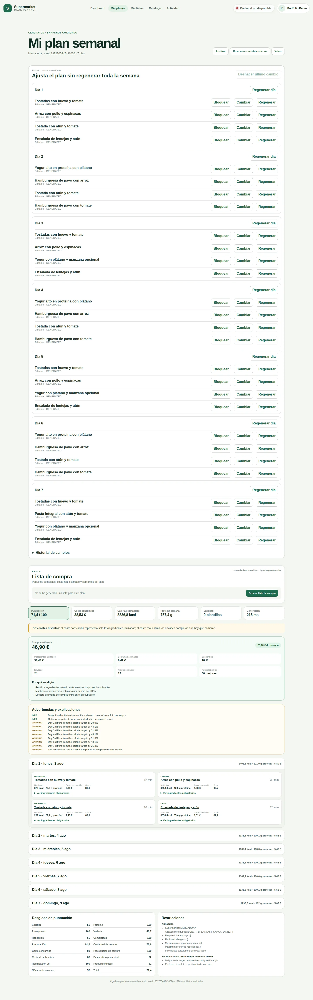
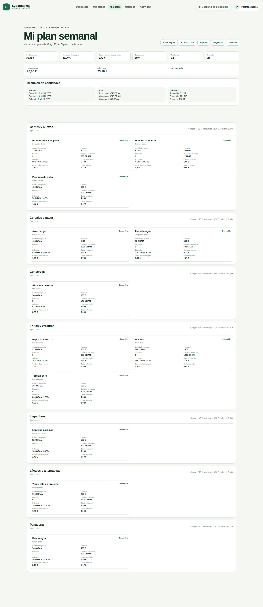

# Case study — Supermarket Meal Planner

## Problema

Traducir objetivos nutricionales y presupuesto a un plan comprable exige trabajar con envases completos, sobrantes, disponibilidad y datos históricos, no solo sumar porciones ideales.

## Solución

Un monolito modular Spring Boot mantiene catálogo, plantillas, generación determinista, listas, identidad y administración. React ofrece la experiencia pública/privada. Airflow separa sincronización y enriquecimiento mediante staging e idempotencia. PostgreSQL y snapshots preservan explicabilidad.

## Decisiones destacadas

- JWT breve en cookie HttpOnly, refresh opaco rotatorio y CSRF.
- Scoring clásico compatible y optimización purchase-aware explicable.
- Snapshots y versionado para edición, undo, duplicación y freshness.
- Proveedores externos aislados; producción deshabilita mocks por defecto.
- Compose productivo de una máquina con redes privadas y observabilidad opcional.

## Evidencia

La verificación local de FASE 11 produjo resultados reproducibles: 102 pruebas
backend en 147 s, 57 pruebas frontend, 9 pruebas Python y 17 escenarios
Playwright en 390, 768, 1024 y 1440 px. El bundle inicial medido fue 347,88 kB
(103,94 kB gzip). El smoke de producción con TLS autofirmado completó `/healthz`
y la landing en 38,5 s, incluyendo arranque y limpieza del entorno aislado.

El backup custom-format de ambas bases se verificó con `pg_restore --list` y se
restauró en una base temporal: 6 usuarios, 24 productos, 10 planes, 10 listas y
12 ejecuciones Airflow, sin modificar la base principal. La operación local
combinada tardó 6,2 s; es una medición, no una garantía de RTO.

No se publican cifras para el benchmark de 100/1.000 productos mientras no se
ejecute en hardware de referencia; los workflows conservan resultados reales y
no convierten objetivos en afirmaciones.

Los resultados de pruebas, tamaños, tiempos, memoria e imágenes se documentan únicamente después de ejecutar los comandos reproducibles. Este documento no inventa benchmarks; consulta el informe de verificación de la fase para valores medidos.
